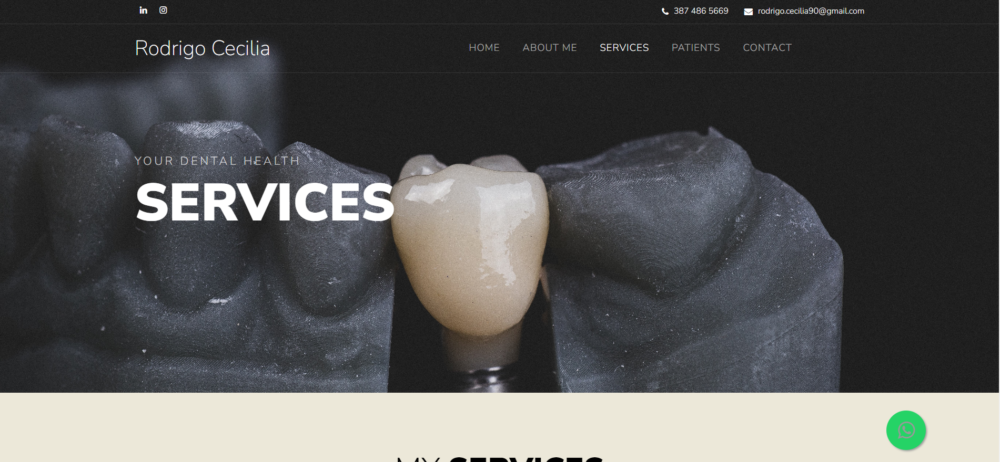
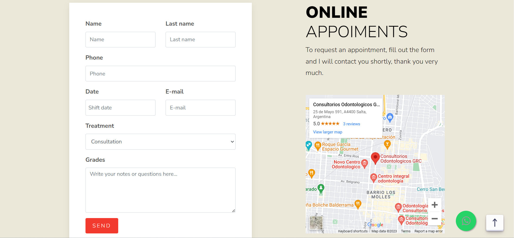

# 🦷Dentist Portfolio Website🦷

Welcome to the Dentist Portfolio Website! This repository contains the source code for a professional dentist's portfolio. 
The website showcases the dentist's expertise, services, and patient show cases.

## About the Dentist

**BE AWARE: All the information provided is about a dentist (my client). He have generously agreed to make his website open source, welcoming anyone who wishes to fork this project and create their own unique version.**
Dr. Rodrigo Cecilia is a highly skilled and compassionate dentist with 5 years of experience in providing exceptional dental care. He is dedicated to improving patients' oral health and creating beautiful smiles.

## Features

- **Home:** Overall view of the whole content of the website.

- **About Me:** Information about the dentist, including certifications.

- **Services:** Explore a comprehensive list of dental services offered by the dentist, including routine check-ups, cosmetic dentistry, and more.

- **Patients:** Before-and-after showcases featuring the remarkable transformations of his patients and the outstanding dental work performed by the dentist.

- **Contact:** Easily get in touch with the dentist's clinic to schedule an appointment or ask questions.

## Website Screenshots





## Installation

To view and explore the Dentist Portfolio Website locally, follow these steps:

1. Clone the repository to your local machine:

   ```bash
   git clone https://github.com/GasparBonari/Dentist

2. Open the index.html file in a web browser to access the website.

## Usage
You can use this website as a template for your own dentist portfolio or explore it to learn about the dentist's expertise and patient care approach.

## Contributing
We welcome contributions to enhance and improve the Dentist Portfolio Website. If you have suggestions, bug reports, or would like to contribute to its development, please feel free to contribute.

## License
This project is licensed under the Gaspar Bonari and Colorlib License.
